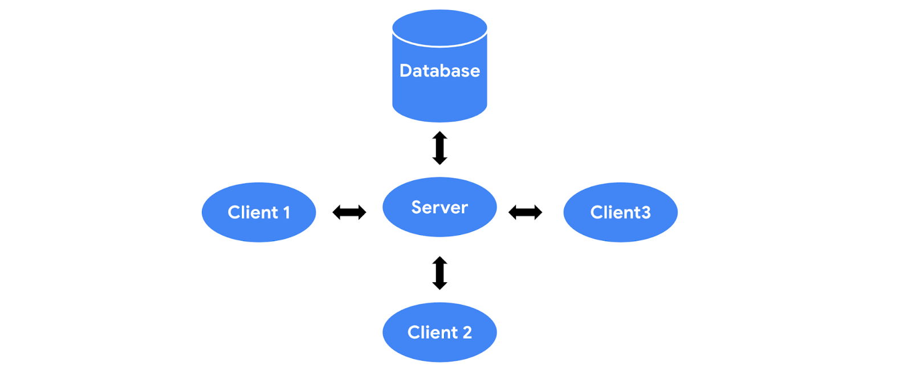
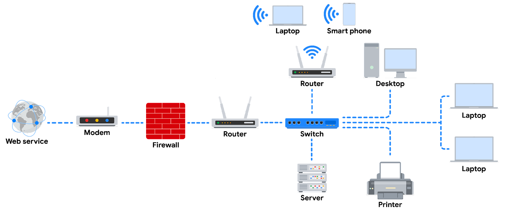

# Cybersecurity Notes

## Contents

- [Cybersecurity Notes](#cybersecurity-notes)
  - [Contents](#contents)
  - [Cybersecurity](#cybersecurity)
    - [Common Terms](#common-terms)
  - [Historic Cybersecurity Attacks](#historic-cybersecurity-attacks)
    - [Brain Virus](#brain-virus)
    - [Morris Worm](#morris-worm)
  - [Modern Cybersecurity Attacks](#modern-cybersecurity-attacks)
    - [LoveLetter Attack (aka ILOVEYOU virus)](#loveletter-attack-aka-iloveyou-virus)
    - [Equifax Breach](#equifax-breach)
  - [Common Cybersecurity Attacks](#common-cybersecurity-attacks)
    - [Phishing](#phishing)
    - [Malware](#malware)
    - [Social Engineering](#social-engineering)
      - [Social Engineering Principles](#social-engineering-principles)
    - [Data Breaches: Maintain your cool](#data-breaches-maintain-your-cool)
  - [CISSP (Certified Information Systems Security Professional) Security Domains](#cissp-certified-information-systems-security-professional-security-domains)
  - [Determining the Type of Attack](#determining-the-type-of-attack)
    - [Password Attack](#password-attack)
    - [Social Engineering Attack](#social-engineering-attack)
    - [Physical Attack](#physical-attack)
    - [Adversarial Artificial Intelligence](#adversarial-artificial-intelligence)
    - [Supply Chain Attack](#supply-chain-attack)
    - [Cryptographic Attack](#cryptographic-attack)
  - [Understanding Attackers](#understanding-attackers)
    - [Threat Actor Types](#threat-actor-types)
      - [Advanced Persistent Threats](#advanced-persistent-threats)
      - [Insider Threat](#insider-threat)
      - [Hacktivists](#hacktivists)
    - [Hacker Types](#hacker-types)
  - [Frameworks and Controls](#frameworks-and-controls)
  - [Secure Design](#secure-design)
  - [Ethics in Cybersecurity](#ethics-in-cybersecurity)
    - [Ethical Principles in Security](#ethical-principles-in-security)
    - [Ethical Concerns and Laws Related to Counterattacks](#ethical-concerns-and-laws-related-to-counterattacks)
      - [US's Standpoint on Counterattacks](#uss-standpoint-on-counterattacks)
      - [ICJ's Standpoint on Counterattacks](#icjs-standpoint-on-counterattacks)
  - [Common Cybersecurity Tools](#common-cybersecurity-tools)
    - [Security Information and Event Management (SIEM) Tools](#security-information-and-event-management-siem-tools)
    - [Other Tools](#other-tools)
    - [General Purpose Tools](#general-purpose-tools)
  - [8 CISSP Domains](#8-cissp-domains)
    - [Dom. 1: Security and Risk Management](#dom-1-security-and-risk-management)
    - [Dom. 2: Asset Security](#dom-2-asset-security)
    - [Dom. 3: Security Architecture and Engineering](#dom-3-security-architecture-and-engineering)
    - [Dom. 4: Communication and Network Security](#dom-4-communication-and-network-security)
    - [Dom. 5: Identity and Access Management](#dom-5-identity-and-access-management)
    - [Dom. 6: Security Assessment and Testing](#dom-6-security-assessment-and-testing)
    - [Dom. 7: Security Operations](#dom-7-security-operations)
    - [Dom. 8: Software Development Security](#dom-8-software-development-security)
  - [Threats, Risks and Vulnerabilities](#threats-risks-and-vulnerabilities)
    - [Impact study of Ransomware](#impact-study-of-ransomware)
    - [Key Impacts of Threats, Risk and Vulnerabilities](#key-impacts-of-threats-risk-and-vulnerabilities)
  - [Layers of the Web](#layers-of-the-web)
  - [NIST's Risk Management Framework](#nists-risk-management-framework)
  - [Common Risk Management Strategies](#common-risk-management-strategies)
  - [Frameworks](#frameworks)
  - [Controls](#controls)
  - [The CIA Triad](#the-cia-triad)
  - [NIST Cybersecurity Framework (CSF)](#nist-cybersecurity-framework-csf)
  - [OWASP Security Principles](#owasp-security-principles)
  - [Security Audits](#security-audits)
  - [Logs](#logs)
  - [Security Information and Event Management (SIEM) Tools](#security-information-and-event-management-siem-tools-1)
    - [Splunk](#splunk)
      - [Security posture dashboard](#security-posture-dashboard)
      - [Executive summary dashboard](#executive-summary-dashboard)
      - [Incident review dashboard](#incident-review-dashboard)
      - [Risk analysis dashboard](#risk-analysis-dashboard)
    - [Chronicle](#chronicle)
      - [Enterprise insights dashboard](#enterprise-insights-dashboard)
      - [Data ingestion and health dashboard](#data-ingestion-and-health-dashboard)
      - [IOC matches dashboard](#ioc-matches-dashboard)
      - [Main dashboard](#main-dashboard)
      - [Rule detections dashboard](#rule-detections-dashboard)
      - [User sign in overview dashboard](#user-sign-in-overview-dashboard)
  - [Playbooks](#playbooks)
    - [Incident and Vulnerability Response Playbook](#incident-and-vulnerability-response-playbook)
  - [Networks](#networks)
    - [Common Network Devices](#common-network-devices)

## Cybersecurity

It is the practice of ensuring **confidentiality, integrity and availability** of information by protecting network, devices, people and data from unauthorized access and criminal exploitation.

A **threat actor** is any person or group that presents a security risk.

Security protects us from _internal_ and _external_ threats. An **internal threat** is posed by current or former employees, external vendors or trusted partners (basically, from anyone associated with the organization). An **external threat** is from someone outside the organization trying to gain access to private information, networks, or devices.

Often, the internal threats are accidental, such as an employee clicking on a compromized link in an email. Nonetheless, they may be intentional as well, such as an internal actor trying to gain unauthorized access to some data or abusing systems for personal use.

Security teams also ensure compliance with regulations and laws that may require implementation of certain security standards. This prevents organizations from fines and other charges, while allowing them to satisfy their ethical obligation to protect their users.

Security teams also maintain and improve business productivity, by establishing business continuity plans. This allows employees to do their jobs even in the case of an event such as a data breach.

Upholding security reduces expenses because of downtime, breaches and fines. It also helps in maintaining brand trust.

### Common Terms

1. **Compliance**: The process of adhering to internal standards and external regulations. It enables organizations to avoid fines and security breaches.
2. **Security Frameworks**: These are guidelines used for building plans to help mitigate risks and threats to data and privacy.
3. **Security Controls**: They are safeguards designed to reduce _specific_ security risks. They are used with security frameworks to establish a strong security posture.
4. **Security Posture**: It is an organization's ability to manage its defence of critical assets and data and react to change. A strong security posture leads to lower risk for the organization.
5. **Threat**: Any circumstance or event that can negatively impact assets.
6. **Threat Actor**: [aka **malicious attacker**] Any person or group that poses a security risk. The risk may relate to computers, applications, networks and data.
7. **Network Security**: It is the practice of keeping an organization's network infrastructure secure from unauthorized access. This includes services, data, systems and devices that are stored in an organization's network.
8. **Cloud Security**: It is the process of ensuring that assets stored in the cloud are properly configured, or set up correctly and access to those assets is limited to authorized users.
9. **Programming**: The process to create a specific set of instructions for a computer to execute tasks such as:
   1. Automation of repetitive tasks (e.g., searching a list of malicious domains)
   2. Reviewing web traffic
   3. Alerting suspicious activity
10. **Personally Identifiable Information (PII)**: Any information used to infer an individual's identity.
11. **Sensitive Personally Identifiable Information (SPII)**: A specific type of PII that falls under stricter handling guidelines, such as AadharID or biometric data. SPII theft poses a significantly larger threat to an individual as compared to PII theft.

> PII and SPII are major targets for actors engaging in identity theft (the act of stealing personal information to commit fraud while impersonating a victim; its primary objective is financial gain).

More information of cybersecurity terms is available at the [NIST Glossary](https://csrc.nist.gov/glossary).

## Historic Cybersecurity Attacks

Often, attackers use modifications of past attacks, and therefore understanding the past attacks can help create a secure system and organization.

**Computer Virus**: Malicious code written to interfere with computer operations and cause damage to data and software. A virus often attaches itself to programs or data on a computer, then spreads and infects one or more computers in a network.

**Malware**: This is any software designed to harm devices or networks. Viruses are often refered to as malware, but malware includes many other kinds of software as well.

We will examine 2 early malware attacks: **Brain virus** and **Morris worm**. These were developed to accomplish specific tasks, but their developers underestimated the amount of damage and the number of infected computers these would cause.

### Brain Virus

It was created by the Alvi brothers in 1986, with the intention to track illegal copies of medical software and prevent pirated licenses. However, the actual effect of the virus was unexpected.

Once a person used a pirated copy of the software, the virus infected that computer. _Any_ disk that was connected to that computer also got infected.

Each time someone used an infected disk, the virus moved to a new computer. Thus undetected, the virus spread globally within a couple of months.

While the intention behind the virus was not to cause harm to data and software, it slowed productivity and significantly affected business operations.

This virus presents an important event in the field of software, demonstrating the need for security and maintaining productivity.

### Morris Worm

Developed by Robert Morris in 1988, its original objective was to assess the size of the Internet. The program would crawl the web, and install itself onto other computers to tally the number of computers that were connected to the Internet.

However, the worm failed to keep track of the computers it had already compromized, and continued to re-install itself, **untill the computers ran out of memory and crashed.**

About 6000 computers were affected, representing _10%_ of the Internet at the time.

This attack cost millions of dollars in damages due to business disruptions and the efforts required to remove the worm.

> After the Morris worm, **Computer Emergency Response Teams** (CERTs) were established to respond to computer security incidents. These continue to exist today.

## Modern Cybersecurity Attacks

With the spread of the Internet, lots of computers are accessible without the need for physical access to hardware devices or data transfer devices.

We will examine 2 notable attacks that relied on the Internet: the **LoveLetter Attack** and the **Equifax Breach**.

### LoveLetter Attack (aka ILOVEYOU virus)

In the year 2000, Onel de Guzman created the LoveLetter malware to steal Internet login credentials. This attack spread rapidly. The people who weren't yet suspicious of unsolicited emails were especially affected.

Victims recieved an email with the subject line `I Love You`, and an attachment labelled `Love Letter For You`. When the attachment was opened, the malware scanned the user's address book. Then, it automatically sent itself to each person on the list, and installed a program to collect user information and passwords.

Recipients would think that they are recieving an email from a friend, but it would actually be malware.

This malware ended up affecting **45 million computers** globally, and is believed to have caused over **$10 billion** in damages.

This attack is also an example of social engineering.

**Social Engineering**: A manipulation technique that exploits human error to gain private information, access or valuables.

This attack showed attackers the power of social engineering. The number of social engineering attacks increases with every new social media.

Its common now for employees to recieve training in how to identify social engineering attacks, specifically, phishing.

**Phishing**: The use of digital communications to trick people into revealing sensitive data or deploy malicious software.

### Equifax Breach

In 2017, attackers successfully infiltrated the credit reporting agency, Equifax. This was one of the **largest known data breaches of sensitive information**. During the breach, over 143 million customer records (that included PII) were stolen, and the breach affected approximately 40% of all Americans.

The breach occurred due to multiple failures on Equifax's part. The company failed to take action to fix multiple known vulnerabilities in the months leading up to the data breach.

The company had to pay over $575 million to resolve customer complaints and cover required fines.

This large fine alerted other companies to take measures to prevent such a breach on their systems.

## Common Cybersecurity Attacks

### Phishing

Phishing is the use of digital communications to trick people into revealing sensitive data or deploying malicious software.

Some common types of these attacks are:

1. **Business Email Compromise (BEC)**: A threat actor sends an email message that seems to be from a known source to make a seemingly legitimate request for information in order to obtain a financial advantage.
2. **Spear Phishing**: A malicious email attack that targets a specific user or group of users. The email seems to originate from a trusted source.
3. **Whaling**: It is a form of spear phishing, where threat actors target company executives to gain access to sensitive data.
4. **Vishing**: The exploitation of electronic voice communication to obtain sensitive information or to impersonate a known source.
5. **Smishing**: The use of text messages to trick users, in order to obtain sensitive information or to impersonate a known source.

### Malware

Malware is software designed to harm devices or networks. There are many types of malware. The primary purpose of malware is to obtain money, or in some cases, an intelligence advantage that can be used against a person, an organization, or a territory.

Some common types of malware are:

1. **Viruses**: Malicious code written to interfere with computer operations and cause damage to data and software.
   1. A virus **needs to be _initiated_ by a user** (i.e., _this user is the threat actor here, not necessarily the virus developer_), who transmits the virus via a malicious attachment or file download.
   2. When someone opens the malicious attachment or download, the virus hides itself in other files in the now infected system.
   3. When the infected files are opened, it allows the virus to insert its own code to damage and/or destroy data in the system.
2. **Worms**: Malware that can _duplicate and spread itself across systems on its own_. Unlike a virus, a worm does not need to be downloaded by the user. Instead, it self-replicates and spreads from an already infected computer to other devices on the same network.
3. **Ransomware**: A malicious attack, where the threat actors _encrypt_ an organization's data and demand payment to restore access.
4. **Spyware**: A malware that is used to gather and sell information without consent. Spyware can be used to access devices. This allows threat actors to collect personal data such as private emails, texts, voice and image recordings, and locations.

### Social Engineering

Social engineering is a manipulation technique that exploits human error to gain private information, access, or valuables. **Human error** is usually a result of trusting someone without question. _It's the mission of a threat actor, acting as a social engineer, to create an environment of **false trust** and lies to exploit as many people as possible._

Some of the most common social engineering attacks today are:

1. **Social media phishing**: A threat actor collects detailed information about their target from social media sites. Then, they initiate an attack.
2. **Watering hole attack**: A threat actor attacks a website frequently visited by a specific group of users.
3. **USB baiting**: A threat actor strategically leaves a malware USB stick for an employee to find and install, to unknowingly affect a network.
4. **Physical social engineering**: A threat actor impersonates an employee, customer or vendor to obtain unauthorized access to a physical location.

#### Social Engineering Principles

Social engineering is incredibly effective. This is because people are generally trusting and conditioned to respect authority. The number of social engineering attacks is increasing with every new social media application that allows public access to people's data.

Reasons why social engineering attacks are so effective include:

- **Authority**: Threat actors impersonate individuals with power. This is because people, in general, have been conditioned to respect and follow authority figures.
- **Intimidation**: Threat actors use bullying tactics. This includes persuading and intimidating victims into doing what they are told.
- **Consensus/Social Proof**: Because people sometimes do things that they believe many others are doing, threat actors use others' trust to pretend they are legitimate. For example, a threat actor might try to gain access to private data by telling an employee that other people at the company have given them access to that data in the past.
- **Scarcity**: A tactic used to imply that goods or services are in limited supply.
- **Familiarity**: Threat actors establish a fake emotional connection with users that can be exploited.
- **Trust**: Threat actors establish an emotional relationship with users that can be exploited _over time_. They use this relationship to develop trust and gain personal information.
- **Urgency**: A threat actor persuades others to respond quickly and without questioning.

### Data Breaches: Maintain your cool

If we are on the security team and responding to a data breach incident, we have to remain calm and composed. Others in the "room" may be upset and worried, but we have to be reassuring and remain calm.

The first thing we should do is to contain the breach. This means that **if we are still losing data, we should do everything in our power to stop the loss.** This may involve _shutting down the server, shutting down the data center or the data center communications_. Stopping the data loss is the first priority.

> First stop the breach, and then investigate the breach.

Executing the incident management plan is the most important thing we should keep in mind as an entry level analyst.

## CISSP (Certified Information Systems Security Professional) Security Domains

There are 8 security domains defined by CISSP to assist and organize the work of security professionals. **Security roles may focus on one domain or include several domains**.

Gaps in any of these can harm an organization.

The domains are:

1. **Security and Risk Management**: It defines security goals and objectives, risk mitigation, compliance, business continuity and the law. For e.g., updating company policies about some PII storage as the laws change.
2. **Asset Security**: It secures digital and physical assets. It's also related to the storage, maintenance, retention and destruction of data. For e.g., ensuring older equipment is properly destroyed, including any kind of sensitive information.
3. **Security Architecture and Engineering**: It optimizes data security by ensuring effective tools, systems, and processes are in place. For e.g., setting up a firewall.
4. **Communications and Network Security**: Manage and secure physical networks and wireless communications. For e.g., analysing user behaviour within the organization for suspicious activity or unsecured connections.
5. **Identity and Access Management**: It keeps data secure, by ensuring users follow established policies to control and manage physical assets, like office spaces, and logical assets, such as networks and applications. This includes validating employees' identities and documenting their access roles. For e.g., setting up employees' key card access to buildings.
6. **Security Assessment and Testing**: It involves conducting security control testing, collecting and analysing data and conducting security audits to monitor for risks, threats and vulnerabilities. For e.g., conducting audits to ensure access to payroll data is only given to those employees who require it.
7. **Security Operations**: Conducting investigations and implementing preventative measures. E.g., addressing an alert that an unknown device has connected to the network.
8. **Software Development Security**: Uses secure coding practices, which are a set of recommended guidelines that are used to create secure applications and services. For e.g., working with software teams to ensure that secure coding practices are involved in the SDLC.

## Determining the Type of Attack

### Password Attack

These attacks try to access password-secured devices, systems, networks or data. For e.g., brute force attacks and rainbow table attacks.

These fall under the communication and network security domain.

### Social Engineering Attack

Social engineering is a manipulation technique that exploits human error to gain private information, access, or valuables. For e.g., phishing, smishing, vishing, spear phishing, whaling, social media phishing, business Email Compromise (BEC), watering hole attack, usb (Universal Serial Bus) baiting, physical social engineering.

These fall under the security and risk management domain.

### Physical Attack

A physical attack is a security incident that affects not only digital but also physical environments where the incident is deployed. For e.g., malicious USB cable, malicious flash drive, and card cloning and skimming.

These attacks fall under the asset security domain.

### Adversarial Artificial Intelligence

Adversarial AI uses AI and ML techniques (described [here](https://nvlpubs.nist.gov/nistpubs/ai/NIST.AI.100-2e2023.pdf)) to conduct attacks more efficiently.

Adversarial AI falls under both the communication and network security and the identity and access management domains.

### Supply Chain Attack

These attacks target systems, applications, hardware and/or software to locate a vulnerability where malware can be deployed.

These attacks cause a breach at any point in the supply chain. They are costly as they can affect multiple organizations and the individuals who work for them.

They fall under several CISSP domains, including but not limited to security and risk management, security architecture and engineering, security operations.

### Cryptographic Attack

These attacks affect secure forms of communications between a sender and an intended recipient. For e.g., birthday attacks, collision attacks and downgrade attacks.

They fall under the communication and network security domains.

## Understanding Attackers

A **threat actor** is any person or group that presents a security risk.

### Threat Actor Types

#### Advanced Persistent Threats

Advanced persistent threats (APTs) have significant expertise accessing an organization's network without authorization.

They tend to **research their targets** (which include government entities and large corporations) in advance and can **remain undetected** for an extended period of time.

Their intentions and motivations can include:

1. Damaging critical infrastructure such as the power grid and natural resources.
2. Gaining access to intellectual property such as trade secrets or patents.

#### Insider Threat

Insider threats abuse their authorized access to obtain data that may harm an organization.

Their intentions and motivations can include:

1. Sabotage
2. Corruption
3. Espionage
4. Unauthorized data access or leaks

#### Hacktivists

These are threat actors driven by political agenda.

Their goals may include:

1. Demonstrations
2. Propaganda
3. Social change campaigns
4. Fame

### Hacker Types

**Hacker**: Any person who uses computers to gain access to computer systems, networks or data.

Hackers can be beginner or advanced technology professionals who use their skills for a variety of reasons.

There are 3 main **categories of hackers**:

1. **Authorized Hackers**: [aka Ethical Hackers] They follow a code of ethics and adhere to the law to conduct organizational risk evaluations. They are motivated to safeguard people and organizations from malicious threat actors.
2. **Semi-authorized Hackers**: They are considered researchers. They search for vulnerabilities but don't take advantage of the vulnerabilities they find.
3. **Unauthorized Hackers**: [aka Unethical Hackers] They are malicious threat actors who do not follow or respect the law. Their goal is to collect and sell confidential data for financial gain.

> There are multiple hacker types that fall into one or more of these categories.

New and unskilled actors have various goals including:

1. To learn and enhance their hacking skills.
2. To seek revenge.
3. To exploit security weaknesses by using existing malware, programming scripts and other tactics.

Other types of hackers are not motivated by any particular agenda other than completing the job they were contracted to do. These types of hackers can be considered unethical or ethical hackers. They have been known to work on both illegal and legal tasks for pay.

There are also hackers who consider themselves vigilantes. Their main goal is to protect the world from unethical hackers.

## Frameworks and Controls

To secure our organization from threats, we start with identifying critical assets and risks. Then, we implement the necessary frameworks and controls.

**Security Frameworks**: These are guidelines used for building plans to help mitigate risk and threats to data and privacy. They essentially provide a structured approach to document and implement a security lifecycle.

**Security Lifecycle**: A constantly evolving set of policies and standards that define how an organization manages risks, follows established guidelines, and meets regulatory compliance and laws.

The following are the purposes of security frameworks:

1. Protecting PII
2. Securing financial information
3. Identifying security weaknesses
4. Managing organizational risks
5. Aligning security with business goals

Frameworks have **4 core components**:

1. **Identifying and documenting security goals** (for e.g., an organization may have a goal to align with the E.U.'s GDPR. Consequently, a security analyst may be asked to identify and document areas where the organization is out of compliance with GDPR.)
2. **Setting guidelines to acheive security goals** (for e.g., when implementing guidelines to acheive GDPR compliance, an organization may have to develop new policies on how to handle data requests from individual users.)
3. **Implementing strong security processes** (for e.g., in case of GDPR, a security analyst working for a social media company may help design procedures to ensure the organization complies with verified user data requests. Such a request could be when a user attempts to update or delete their profile information.)
4. **Monitoring and communicating results** (for e.g., we may monitor our organization's internal network and report a potential security issue affecting GDPR to a manager or to a regulatory compliance officer.)

**Security controls**: They are safeguards designed to reduce specific security risks. For e.g., a guideline requiring all employees to complete a privacy training to reduce the risk of data breaches.

## Secure Design

**CIA Triad**: It is a foundational model that helps inform how organizations consider risk when setting up systems and security policies.

***C*onfidentiality**: Only authorized users can access specific assets or data. For e.g., strict access controls.

***I*ntegrity**: Data is correct, authentic and reliable. For e.g., encryption to protect data from tampering.

***A*vailability**: Data is available to those who are authorized to access it.

**Asset**: An item percieved as having value to an organization. The value is generally determined by the cost associated with the asset.

**Cybersecurity Framework: NIST CSF**: It is a voluntary framework that consists of standards, guidelines and best practices to manage cybersecurity risk.

Some other controls, frameworks, and compliance standards are:

1. **NIST RMF (Risk Management Framework)**
2. **The Federal Energy Regulatory Commission - North American Electric Reliability Corporation (FERC-NERC)**
   1. This is a _regulation_.
   2. It applies to organizations that work with electricity or that are involved with the U.S. and North American power grid.
   3. It defines some _Critical Infrastructure Protection (CIP) Reliability Standards_ the orgs must adhere to.
3. **The Federal Risk and Authorization Management Program (FedRAMP®)**
   1. This is a _U.S. federal government program_.
   2. It standardizes security assessment, authorization, monitoring, and handling of cloud services and product offerings to provide consistency across the government sector and third-party cloud providers.
4. **Center for Internet Security (CIS®)**
   1. This is a _nonprofit with multiple areas of emphasis_.
   2. It _provides a set of controls_ that can be used to safeguard systems and networks against attacks. Its purpose is to help organizations establish a better plan of defense.
   3. It also provides actionable controls that security professionals may follow if a security incident occurs.
5. **General Data Protection Regulation (GDPR)**
   1. It is a _European Union (E.U.) general data regulation_.
   2. It protects the processing of E.U. residents' data and their right to privacy in and out of E.U. territory.
6. **Payment Card Industry Data Security Standard (PCI DSS)**
   1. It is an _international security standard_.
   2. It ensures that organizations storing, accepting, processing, and transmitting credit card information do so in a secure environment.
   3. Its objective is to reduce credit card fraud.
7. **The Health Insurance Portability and Accountability Act (HIPAA)**
   1. It is a _U.S. federal law_.
   2. It prohibits patient information from being shared without their consent.
   3. It has 3 rules: Privacy, Security and Breach notification.
   4. **Protected Health Information (PHI)**: It relates to the past, present, or future physical or mental health or condition of an individual, whether it's a plan of care or payments for care.
   5. **Health Information Trust Alliance (HITRUST®)**: It is a security framework and assurance program that helps institutions meet HIPAA compliance.
8. **International Organization for Standardization (ISO)**
   1. It is a _standards' organization_.
   2. It was created to establish international standards related to technology, manufacturing, and management across borders. It helps organizations improve their processes and procedures for staff retention, planning, waste, and services.
9. **System and Organizations Controls (SOC type 1, SOC type 2)**
   1. This is a _standard_.
   2. It was developed by American Institute of Certified Public Accountants® (AICPA) auditing standards board.
   3. SOC1 and SOC2 are a series of reports that focus on an organization's user access policies at different organizational levels such as Associate, Supervisor, Manager, Executive, Vendor and Others.
   4. SOC1 and SOC2 are used to assess an organization's financial compliance and levels of risk. They also cover confidentiality, privacy, integrity, availability, security, and overall data safety. Control failures in these areas can lead to fraud.

> One of the most dangerous threat actors are disgruntled employees, as they have access to sensitive information and know where to find it. To reduce this type of risk, we would use the principle of availability and the organizational guidelines based on frameworks, to ensure staff members only access the data they need to perform their jobs.

## Ethics in Cybersecurity

Ethically, our job is to remain unbiased and maintain security and confidentiality.

**Security Ethics**: Guidelines for making appropriate decisions as a security professional.

### Ethical Principles in Security

1. Confidentiality: Proprietary or private information such as PII must be kept confidential and safe. There needs to be a high level of respect for privacy to safeguard private assets and data.
2. Privacy Protections: Safeguarding personal information from unauthorized use.
3. Laws: The rules that are recognized by a community and enforced by a governing entity.

As a security professional, we must:

1. Remain unbiased and conduct our work honestly, responsibly, and with the highest respect for the law.
2. Be transparent and just, and rely on evidence.
3. Ensure that we are consistently invested in the work we are doing, so we can appropriately and ethically address issues that arise.
4. Stay informed and strive to advance our skills, so we can contribute to the betterment of the cyber landscape.

### Ethical Concerns and Laws Related to Counterattacks

#### US's Standpoint on Counterattacks

In the US, deploying a counterattack on a threat actor is illegal and only defence is allowed. Counterattacks are seen as acts of vigilantism. (A vigilante is a person who is not a member of law enforcement who decides to stop a crime on their own.)

Counterattacks can lead to further escalation, leading to more damage and harm. Furthermore, if the attack was undertaken by a state-sponsored hacktivist (from another country), it could lead to serious international implications.

#### ICJ's Standpoint on Counterattacks

ICJ says that a person or group can counterattack if:

1. The counterattack will only affect the party that attacked first.
2. The counterattack is a direct communication asking the initial attacker to stop.
3. The counterattack does not escalate the situation.
4. The counterattack effects can be reversed.

Typically, organizations do not counterattack as the above scenarios are hard to measure.

## Common Cybersecurity Tools

**Log**: It is a record of events that occur within an organization's systems, such as employees signing into their computers or accessing web based services.

### Security Information and Event Management (SIEM) Tools

These are applications that collect and analyse log data to monitor critical activities in an organization. These tools collect real time information, allowing security analysts to identify potential breached as they happen.

SIEM tools have a dashboard like interface that visually organizes data into categories. Users can then select the data they wish to analyse.

Splunk and Chronicle are two commonly used SIEM tools.

**Splunk** is a data analysis platform. It is provided by the Splunk Enterprise as a self-hosted tool.

**Chronicle** is a cloud based SIEM tool provided by Google.

These tools collect data from multiple sources, and then analyse the data to identify potential security threats.

### Other Tools

**Playbook**: A manual that provides details about any operational action. They essentially guide security analysts on how to respond to a security incident before, during and after it has occurred. Different organizations have different playbooks, but the idea is to provide a step by step guide to the security analysts to complete specific tasks.

Consider as an example a forensic team investigating a security breach at a medical company for insurance purposes. In a forensic investigation, we may follow one of 2 playbooks:

1. **Chain of Custody Playbook**: **Chain of custody** is the process of documenting evidence possession and control during an incident lifecycle. We'll need to document who, what, where, and why we have the collected evidence. Evidence must be kept safe and tracked. Every time evidence is moved, it should be reported. This allows all parties involved to know exactly where the evidence is at all times.
2. **Protecting and Preserving Evidence Playbook**: Protecting and preserving evidence is the process of properly working with fragile and volatile digital evidence. In this playbook, we consult the **order of volatility**, which is a sequence outlining the order of data that must be preserved from first to last. It prioritizes volatile data, which is data that may be lost if the device in question powers off, regardless of the reason. While conducting an investigation, improper management of digital evidence can compromise and alter that evidence. _When evidence is improperly managed during an investigation, it can no longer be used._ For this reason, the first priority in any investigation is to properly preserve the data. We can preserve the data by making copies and conducting your investigation using those copies.

**Network Protocol Analyser**: [aka Packet Sniffer] This is a tool designed to capture and analyse data traffic within a network. These tools therefore keep a record of all the data that a computer within an organization's network encounters. For e.g., tcpdump and Wireshark.

### General Purpose Tools

Linux, SQL and Python are commonly used in cybersecurity.

**Web Vulnerability**: This is any unique flaw in a web application that a threat actor could exploit by using malicious code or behaviour to allow unauthorized access, data theft and malware deployment.

**Antivirus Software**: [aka anti-malware] This is a program used to prevent, detect and eliminate malware and viruses. Some antivirus softwares can scan the mamory of a device to find patterns that indicate the presence of malware.

**Intrusion Detection System (IDS)**: An IDS is an application that monitors system activity and alerts on possible intrusions. The system scans and analyzes network packets, which carry small amounts of data through a network. The small amount of data makes the detection process easier for an IDS to identify potential threats to sensitive data. Other occurrences an IDS might detect can include theft and unauthorized access.

**Penetration Testing**: [aka Pen-testing] It is the act of participating in a simulated attack that helps identify vulnerabilities in systems, networks, websites, applications and processes. It is a thorough risk assessment that can evaluate and identify external and internal threats, and weaknesses.

**Encryption**: It makes data unreadable and difficult to decode for an unauthorized user. Its main goal is to ensure confidentiality of private data. _Encryption_ is the process of converting data from a readable format to a cryptographically encoded format. _Cryptographic encoding_ means converting plaintext into secure ciphertext. _Plaintext_ is unencrypted information and _secure ciphertext_ is the result of encryption.

> Encoding and encryption serve different purposes. Encoding uses a public conversion algorithm to enable systems that use different data representations to share information, for example, string data can be ASCII encoded or UTF-8 encoded, but neither of these qualifies as encrypted as these are well known string encodings.

## 8 CISSP Domains

**Security Posture**: An organization's ability to manage its defence of critical assets and data, and react to change.

### Dom. 1: Security and Risk Management

It is focussed on defining security goals and objectives, risk mitigation, compliance, business continuity, and legal regulations.

**Defining security goals and objectives**: By doing so, organizations can reduce risks to critical assets and data, such as PII.

**Risk Mitigation**: It is the process of having the right procedures and rules in place to quickly reduce the impact of a risk, like a breach.

**Compliance**: It is the primary method used to develop an organization's internal security policies, regulatory requirements, and independent standards.

**Business Continuity**: An organization's ability to maintain their everyday productivity by establishing risk disaster recovery plans.

**Legal regulations** and **professional and organizational ethics** are other important components of this domain.

**Information security**, or InfoSec, is also related to this domain and refers to a set of processes established to secure information. An organization may use playbooks and implement training as a part of their security and risk management program, based on their needs and perceived risk. There are many InfoSec design processes, such as:

1. Incident response
2. Vulnerability management
3. Application security
4. Cloud security
5. Infrastructure security

As an example, a security team may need to alter how personally identifiable information (PII) is treated in order to adhere to the European Union's General Data Protection Regulation (GDPR).

### Dom. 2: Asset Security

It is focussed on securing digital and physical assets. It's also related to the storage, maintenance, retention and destruction of data.

There should be proper security in place for critical data such as PII and SPII, when stored or moved over a network. Moreover, there should be proper rules in place to decide how to store, maintain and destroy data.

For example, proper destruction of old hard drives.

Conducting a security impact analysis, establishing a recovery plan, and managing data exposure will depend on the level of risk associated with each asset. Security analysts may need to store, maintain, and retain data by creating backups to ensure they are able to restore the environment if a security incident places the organization's data at risk.

### Dom. 3: Security Architecture and Engineering

It is focussed on optimizing data security by ensuring effective tools, systems, and processes are in place to protect an organizations assets and data.

One core concept of shared design architecture is **shared responsibility**. It means all individuals within an organization take an active role in lowering risk and maintaining both physical and virtual security. This involves having policies to allow users to identify and report security concerns. Additional design principles related to this domain include:

1. Threat modeling
2. Least privilege
3. Defense in depth
4. Fail securely
5. Separation of duties
6. Keep it simple
7. Zero trust
8. Trust but verify

An example of managing data is the use of a security information and event management (SIEM) tool to monitor for flags related to unusual login or user activity that could indicate a threat actor is attempting to access private data.

### Dom. 4: Communication and Network Security

It is focussed on managing and securing physical networks and wireless communications. This includes on-site, remote, and cloud communications. For example, globally disallowing employees' laptops from connecting to public networks.

Organizations with remote, hybrid, and on-site work environments must ensure data remains secure, but managing external connections to make certain that remote workers are securely accessing an organization's networks is a challenge. Designing network security controls-such as restricted network access-can help protect users and ensure an organization's network remains secure when employees travel or work outside of the main office.

### Dom. 5: Identity and Access Management

It is focussed on access and authorization to keep data secure, by making sure users follow established policies to control and manage assets. It does this by ensuring user identities are trusted and authenticated and that access to physical and logical assets is authorized.

We should ensure the access to data is limited to what employees need. The goal of IAM is to reduce the overall risk to systems and data. IAM uses **the principle of least privilege**, which is the concept of granting only the minimal access and authorization required to complete a task. As an example, a cybersecurity analyst might be asked to ensure that customer service representatives can only view the private data of a customer, such as their phone number, while working to resolve the customer's issue; then remove access when the customer's issue is resolved.

Consider if all users used the same admin account. It would be very difficult to identify which user performed what activity.

There are **4 main components to IAM**:

1. **Identification**: When a user verifies who they are by providing a username, an access card, or biometric data such as a fingerprint.
2. **Authentication**: It is a verification process to prove a person's identity such as entering a password or PIN.
3. **Authorization**: It takes place once a user's identity has been confirmed. It relates to the level of access of the user, which depends on the role of the user in the organization.
4. **Accountability**: It refers to monitoring and recording user actions such as login attempts to prove systems and data are used properly.

### Dom. 6: Security Assessment and Testing

It is focussed on conducting security control testing, collecting and analysing data, and conducting security audits to monitor for risks, threats and vulnerabilities.

This domain usually involves examining organizational goals and objectives, and evaluating if the controls being used actually achieve those goals.

This involves collecting and analysing security data regularly. Analysts might use security control testing evaluations and security assessment reports to improve existing controls or implement new controls.

Security assessments help organizations determine whether their internal systems are secure or at risk. Organizations might employ penetration testers, often referred to as "pen testers," to find vulnerabilities that could be exploited by a threat actor.

An example of implementing new controls could be the introduction of multi-factor authentication to better protect the organization from threats and risks.

Additionally, this domain emphasizes the importance of conducting security audits to monitor for and reduce the probability of a data breach. To contribute to these types of tasks, cybersecurity professionals may be tasked with auditing user permissions to validate that users have the correct levels of access to internal systems.

### Dom. 7: Security Operations

This domain is focussed on conducting investigations and implementing preventative measures.

Investigations begin once a security incident has been identified. These processes require a heightened sense of urgency in order to minimize potential risks to the organization.

If there is an active attack, mitigating it and preventing it from escalating further is essential for ensuring that private information is protected from threat actors.

Once a threat is neutralized, the collection of digital and physical evidence to conduct a forensic investigation will begin.

A digital forensic investigation must take place to determine when, how and why the breach occurred. This helps security teams to identify areas for improvement and preventative measures that can be taken to mitigate future attacks.

This domain includes using strategies, processes, and tools such as:

1. Training and awareness
2. Reporting and documentation
3. Intrusion detection and prevention
4. SIEM tools
5. Log management
6. Incident management
7. Playbooks
8. Post-breach forensics
9. Reflecting on lessons learned

### Dom. 8: Software Development Security

It is focussed on using secure coding practices. Secure coding practices are recommended guidelines that are used to create secure applications and services.

Security is an additional step in the SDLC. By ensuring that each phase of the SDLC undergoes security reviews, security can be fully integrated into the software product.

For example, performing a secure design review during the design phase, secure code reviews during the development and testing phases, and penetration testing during the deployment and implementation phase.

Performing application security tests can help ensure vulnerabilities are identified and mitigated accordingly. Having a system in place to test the programming conventions, software executables, and security measures embedded in the software is necessary. Having quality assurance and pen tester professionals ensure the software has met security and performance standards is also an essential part of the software development process. For example, an entry-level analyst working for a pharmaceutical company might be asked to make sure encryption is properly configured for a new medical device that will store private patient data.

## Threats, Risks and Vulnerabilities

**Threat**: Any circumstance or event that can negatively impact assets. An example is a social engineering attack (a manipulation technique exploiting human error to gain private information, access or valuables). Another example is phishing (a type of social engineering). Some common threats nowadays are:

1. **Insider Threats**: Staff members or vendors may abuse their authorized access to obtain data that may harm an organization.
2. **Advanced Persistent Threats (APTs)**: These occur when a threat actor maintains unauthorized access to a system for an extended period of time.

**Risks**: They are different from threats. A risk is anything that can impact the confidentiality, integrity or availability of an asset. Risks can be thought of as the _likelihood_ of a threat. An example of risk to an organization is the lack of backup protocols that would allow recovery of stored information in case of any accident or security incident. Another way to understand risks is that `being late to work` is a risk, while `traffic`, `an accident`, `a flat tire`, etc. are threats. Risks are commonly rated on 3 levels: **low risk asset, medium risk asset and high risk asset** depending on possible threats and value of an asset.

**Low-risk asset**: It is information that would not harm the organization's reputation or ongoing operations, and would not cause financial damage if compromized. This includes public information such as website content, published research data.

**Medium-risk asset**: Information that's not available to the public and may cause some damage to the organization's finances, reputation or ongoing operations. For example, the early release of a company's quaterly earnings could impact the value of their stock.

**High-risk asset**: Information protected by regulations or laws, which if compromized would have a severe negative impact on an organization's finances, ongoing operations or reputation. This could include assets containing SPII, PII or intellectual property.

There are different factors that affect the likelihood of a risk to an organization's assets. These include:

1. **External Risk**: Anything outside an organization that has the potential to harm organizational assets, such as threat actors attempting to gain access to private information.
2. **Internal Risk**: A current or former employee, vendor, or trusted partner who poses a security risk.
3. **Legacy Systems**: These are old systems that might not be accounted for or updated, but can still impact assets, such as workstations or old mainframe systems. For example, an organization might have an old vending machine that takes credit card payments or a workstation that is still connected to the legacy accounting system.
4. **Multiparty Risk**: Outsourcing work to third-party vendors can give them access to intellectual property, such as trade secrets, software designs, and inventions.
5. **Software Compliance/Licensing**: Software that is not updated or in compliance, or patches that are not installed in a timely manner pose security risks.

> The [OWASP Top 10](https://owasp.org/www-project-top-ten/) list presents the top 10 risks posed to web applications. The [NIST Cybersecurity Risks List](https://www.nist.gov/itl/smallbusinesscyber/cybersecurity-basics/cybersecurity-risks) presents various common risks posed to software.

**As a security analyst, it is important to stay up-to-date on the most recent risks.**

**Vulnerability**: A weakness that can be exploited by a threat. For example, an outdated firewall, software or application, weak passwords, or unprotected confidential data. _People_ (client, external vendor or employee) can also be considered a vulnerability. People's actions can significantly affect an organization's internal network. Therefore, maintaining security has to be a united effort. This requires training people to act in a secure manner. Organizations must regularly inspect for vulnerabilities within their systems. Some common vulnerabilities are:

1. **ProxyLogon**: A pre-authenticated vulnerability that affects the Microsoft Exchange server. This means a threat actor can complete a user authentication process to deploy malicious code from a remote location.
2. **ZeroLogon**: A vulnerability in Microsoft's Netlogon authentication protocol. An authentication protocol is a way to verify a person's identity. Netlogon is a service that ensures a user's identity before allowing access to a website's location.
3. **Log4Shell**: Allows attackers to run Java code on someone else's computer or leak sensitive information. It does this by enabling a remote attacker to take control of devices connected to the internet and run malicious code.
4. **PetitPotam**: Affects Windows New Technology Local Area Network (LAN) Manager (NTLM). It is a theft technique that allows a LAN-based attacker to initiate an authentication request.
5. **Security logging and monitoring failures**: Insufficient logging and monitoring capabilities that result in attackers exploiting vulnerabilities without the organization knowing it.
6. **Server-side request forgery**: Allows attackers to manipulate a server-side application into accessing and updating backend resources. It can also allow threat actors to steal data.

> For there to be a risk, _both_ threat _and_ vulnerability must be present.

Various lists such as [CISA's Known Exploited Vulnerabilities Catalog](https://www.cisa.gov/known-exploited-vulnerabilities-catalog) and [NIST's National Vulnerability Database](https://nvd.nist.gov/vuln) present various new vulnerabilities.

### Impact study of Ransomware

**Ransomware** is a malicious attack where threat actors encrypt an organization's data and demand payment to restore access.

After deployment, ransomware can freeze network systems, make devices unusable and lock confidential data, making devices inaccessible. The threat actor then demands a ransom before providing a decryption key to allow organizations to return to their normal business operations.

When ransom negotiations occur or data is leaked by a threat actor, these eventa can occur through the dark web.

### Key Impacts of Threats, Risk and Vulnerabilities

1. **Financial Impact**: When an organization's assets are compromized in an attack, the financial consequences can be significant. These can include interrupted production and services, the cost to correct the issue, and fines if assets are compromized because of non-compliance with laws and regulations.
2. **Identity Theft**: Storing any kind of personal data poses a risk to an organization. Sensitive data can include PII, which can be sold or leaked through the dark web. This is because the dark web provides a sense of secrecy, and threat actors may be able to sell data there without legal consequences.
3. **Reputational Damage**: A solid customer base supports an organization's mission, vision and financial goals. An exploited vulnerability can lead customers to seek new business relationships with competitors or create bad press that causes permanent damage to an organization's reputation.
4. There may also be **legal penalties and fines** on the loss of personal data.

## Layers of the Web

The Web is an interlinked network of online content made up of **3 layers**:

1. **Surface Web**: It is the layer that most people use. It's content can be accessed by a web browser.
2. **Deep Web**: The content of the deep web requires authorization to access it. For example, an intranet of an organization, only accessible to individuals with access specifically provided by the organization.
3. **Dark Web**: It can only be accessed using special software. It generally carries a negative connotation since it is the preferred web layer for criminals because of the secrecy it provides.

## NIST's Risk Management Framework

There are **7 steps** in the RMF:

1. **Prepare**: The activities that are necessary to manage security and privacy risks, before a breach occurs. This involves monitoring for risks, and identifying controls that can be used to reduce those risks.
2. **Categorize**: It is used to develop risk management processes and tasks. The risk management processes are used to develop tasks by thinking how the confidentiality, integrity and availability of systems and information can be impacted by risk.
3. **Select**: It involves choosing, customizing and capturing documentation of the controls that protect an organization. For example, keeping the playbook up to date, or helping to manage other documentation that helps the security team manage issues more efficiently.
4. **Implement**: It involves implementing security and privacy plans for the organization. Good plans when implemented minimize the impact of ongoing security risks. For example, if employees constantly require password resets, implementing a change to password requirements may help solve the issue.
5. **Assess**: In this step, we determine if the established controls are implemented correctly. Analysts identify potential weaknesses and determine whether the organization's tools, procedures, controls and protocols should be changed to better manage potential risks.
6. **Authorize**: It involves being accountable for the security and privacy risks that may exist in an organization. It could involve generating reports, developing plans of action, and establishing project milestones that are aligned to the organization's security goals.
7. **Monitor**: It involves being aware of how the systems are operating. Assessing and maintaining technical operations are common tasks for analysts. We should know how the current systems support organizational security goals, and of any need of changes to the systems to better support those goals.

## Common Risk Management Strategies

The following are some common strategies used to manage risks:

1. **Acceptance**: This is accepting a risk to avoid disrupting business continuity.
2. **Avoidance**: It involves creating a plan to avoid the risk altogether.
3. **Transference**: Transferring a risk to a third party to manage.
4. **Mitigation**: Lessening the impact of a known risk.

## Frameworks

Security frameworks are guidelines used for building plans to help mitigate risk and threats to data and privacy.

Security involves not just the virtual space, but also the physical space. Therefore, many organizations have plans to maintain safety in the work environment.

Other security frameworks provide guidance for how to prevent, detect and respond to security breaches.

An especially dangerous attack is social engineering, where employees of an organization are directly attacked. _People are the biggest threat to security._ So, frameworks can be used to create plans to increase employee awareness, and educate them about how they can protect the organization, their co-workers and themselves. An important part of this training is how to detect red flags, and how to promptly report security issues.

**Cyber threat framework** is a framework developed by the U.S. government to provide a common language for describing and communicating information about cyber threat activity. It helps cybersecurity professionals analyze and share information more efficiently. This allows organizations to improve their response to the constantly evolving cybersecurity landscape and threat actors' many tactics and techniques.

**ISO/IEC 27001** is an internationally recognized and used framework. The ISO 27000 family of standards enables organizations of all sectors and sizes to manage the security of assets, such as financial information, intellectual property, employee data, and information entrusted to third parties. This framework outlines requirements for an information security management system, best practices, and controls that support an organization's ability to manage risks. Although the ISO/IEC 27001 framework does not require the use of specific controls, it does provide a collection of controls that organizations can use to improve their security posture.

## Controls

Security controls are used to reduce specific security risks. Three common controls are:

1. **Encryption**: The process of converting data from a readable into an encoded format. This ensures confidentiality of sensitive data.
2. **Authentication**: The process of verifying who someone or something is. For example, passwords, multi-factor authentication, biometrics, etc.

> **Vishing** is the exploitation of electronic voice communication (biometric data) to obtain sensitive information or to impersonate a known source.

3. **Authorization**: It is the concept of granting access to specific resources within a system.

There are various kinds of controls:

1. Examples of **physical controls**: Gates, fences, and locks, Security guards, Closed-circuit television (CCTV), surveillance cameras, and motion detectors, Access cards or badges to enter office spaces.
2. Examples of **technical controls**: Firewalls, MFA, Antivirus software.
3. Examples of **administrative controls**: Separation of duties, Authorization, Asset classification.

## The CIA Triad

It is a model that helps inform how organizations consider risk when setting up systems and security policies. Maintaining an acceptable level of risk and ensuring systems and policies are designed with these elements in mind helps establish a successful security posture.

**Confidentiality**: Only authorized users can access specific assets or data. For e.g., strict access controls and access provisioning on a need-to-know basis. Confidentiality can be enhanced through the implementation of design principles, such as the principle of least privilege. The principle of least privilege limits users' access to only the information they need to complete work-related tasks. Limiting access is one way of maintaining the confidentiality and security of private data.

**Integrity**: Data is correct, authentic and reliable. For e.g., encryption to protect data from tampering. One way to verify data integrity is through cryptography, which is used to transform data so unauthorized parties cannot read or tamper with it (NIST, 2022). Another example of how an organization might implement integrity is by enabling encryption, which is the process of converting data from a readable format to an encoded format. Encryption can be used to prevent access and ensure data, such as messages on an organization's internal chat platform, cannot be tampered with.

**Availability**: Data is available to those who are authorized to access it. When a system adheres to both availability and confidentiality principles, data can be used when needed. In the workplace, this could mean that the organization allows remote employees to access its internal network to perform their jobs. It's worth noting that access to data on the internal network is still limited, depending on what type of access employees need to do their jobs. If, for example, an employee works in the organization's accounting department, they might need access to corporate accounts but not data related to ongoing development projects.

If we work for an organization that has large amounts of private data like a bank, the principle of confidentiality is essential because the bank must keep people's personal and financial information safe. The principle of integrity is also a priority. For example, if a person's spending habits or purchasing locations change dramatically, the bank will likely disable access to the account until they can verify that the account owner, not a threat actor, is actually the one making purchases. The availability principle is also critical. Banks put a lot of effort into making sure that people can access their account information easily on the web. And to make sure that information is protected from threat actors, banks use a validation process to help minimize damage if they suspect that customer accounts have been compromised.

## NIST Cybersecurity Framework (CSF)

It is a voluntary framework that consists of standards, guidelines and best practices to manage cybersecurity risks.

It consists of 5 important core functions:

1. **Identify**: It involves the management of the cybersecurity risk and its effect on an organization's people and assets. This can involve monitoring the devices in an organization's internal network to identify potential security issues.
2. **Protect**: It is the strategy used to protect an organization through the implementation of policies, procedures, training and tools that help mitigate cybersecurity threats. For example, to protect against unknown threats and attacks, we may study historical data and make improvements to policies and procedures.
3. **Detect**: It involves identifying potential security incidents and improving monitoring capabilities to increase the speed and efficiency of detections. For example, we may have to review a new security tool's setup to ensure its flagging low, medium or high risk and then alerting the security team about any potential threats or incidents.
4. **Respond**: It involves making sure that proper procedures are used to contain, neutralize and analyse security incidents, and implement improvements to the security process. This could involve collecting and organizing data to document an incident and suggest improvements to processes to prevent it from happening again.
5. **Recover**: It is the process of returning affected systems back to normal operation. This could involve restoring assets such as financial and legal files that have been affected by an incident such as a breach.

Consider that one day we are notified about a compromized workstation. We first _identify_ the workstation and discover that there's an unknown device plugged into it. We block the device remotely to remove any potential threat and _protect_ the organization. Then, we remove the workstation to prevent the spread of the damage, and use tools to _detect_ any additional threat actor behaviour, and identify the unknown device. We then _respond_ by investigating the incident to determine who used the unknown device, how the threat occurred, what was affected, and where the attack originated. Finally, we work to _recover_ any files or data that were affected and correct any damage the threat caused to the workstation itself.

> The NIST S.P. 800-53 specification provides a framework for use within the US government, and various guidelines for companies working alongside the US government.

## OWASP Security Principles

> OWASP stands for **Open Web (now, Worldwide) Applications Security Project**.

The following are the OWASP security principles:

1. **Minimize the attack surface area.**

**Attack surface** refers to all the potential vulnerabilities that a threat actor could exploit, like attack vectors (pathways used by attackers to penetrate security defenses). Common attack vectors include phishing emails and weak passwords.

> To minimise the attack surface and and avoid incidents from these types of vectors, security teams might disable software features, restrict who can access certain assets, or establish more complex password requirements.

2. **Principle of least priviledge.** This principle requires that users have the least amount of access required to perform their everyday tasks. The main reason that access is limited is to reduce the amount of damage a security breach could cause. So, if a threat actor gains an employee's credentials, they may not have the required access to carry out their attack.
3. **Defence in depth.** This principle requires that an organization should have multiple security controls that address risks and threats in different ways. One example of a security control is multi-factor authentication, or MFA, which requires users to take an additional step beyond simply entering their username and password to gain access to an application. Other controls include firewalls, intrusion detection systems, and permission settings that can be used to create multiple points of defense, a threat actor must get through to breach an organization.
4. **Separation of duties.** It means that no one individual should be given so many priviledges that they can misuse the system. This principle prevents individuals from carrying out fradulent and illegal activities. For example, the person in a company who signs the paychecks shouldn't also be the person who prepares them.

> Critical actions should rely on multiple people, each of whom follow the principle of least privilege.

5. **Keep security simple.** It means that when implementing security controls, unnecessarily complicated solutions should be avoided because they can become unmanageable. The more complex security controls are, the harder it is for people to work collaboratively.
6. **Fix security issues correctly.** When a security incident occurs, it is important for security professionals to identify the root cause quickly. Thereon, it is important to correct any identified vulnerabilities and conduct tests to ensure repairs are successful. An example of an issue is a weak password to access an organization's wifi as it could lead to a breach. To fix this issue, stricter password policies could be put in place.

> When security incidents occur, identify the root cause, contain the impact, identify vulnerabilities, and conduct tests to ensure that remediation is successful.

7. **Establish secure defaults.** This principle means that the optimal security state of an application is also its default state for users; it should take extra work to make the application insecure.
8. **Fail securely.** It means that when a control fails or stops, it should do so by defaulting to its most secure option. For example, when a firewall fails it should simply close all connections and block all new ones, rather than start accepting everything.
9. **Don't trust services.** Many organizations work with third-party partners. These outside partners often have different security policies than the organization does. And the organization shouldn't explicitly trust that their partners' systems are secure. For example, if a third-party vendor tracks reward points for airline customers, the airline should ensure that the balance is accurate before sharing that information with their customers.
10. **Avoid security by obscurity.** The security of an application should not rely on keeping the source code secret. Its security should rely upon many other factors, including reasonable password policies, defense in depth, business transaction limits, solid network architecture, and fraud and audit controls.

> The security of key systems should not rely on keeping details hidden.

## Security Audits

A security audit is a review of an organization's security controls, policies and procedures against a set of expectations. Audits are independent reviews that evaluate whether an organization is meeting internal and external criteria. Internal criteria include outlined policies, procedures, and best practices. External criteria include regulatory compliance, laws, and federal regulations.

Additionally, a security audit can be used to assess an organization's established security controls.

Audits can be **internal or external**.

> The frequency of audits is dependent on local laws and federal compliance regulations.

Factors that determine the types of audits an organization implements include:

1. Industry type
2. Organization size
3. Ties to the applicable government regulations
4. A business’s geographical location
5. A business decision to adhere to a specific regulatory compliance

Frameworks such as the National Institute of Standards and Technology Cybersecurity Framework (NIST CSF) and the international standard for information security (ISO 27000) series are designed to help organizations prepare for regulatory compliance security audits. By adhering to these and other relevant frameworks, organizations can save time when conducting external and internal audits. Additionally, frameworks, when used alongside controls, can support organizations’ ability to align with regulatory compliance requirements and standards.

An internal security audit is typically conducted by a team of people, that might include the organization's compliance officer, security manager and other security team members. Internal security audits help improve an organization's security posture and help in avoiding fines from governing agencies due to a lack of compliance. The major purposes of internal security audits are:

1. Identify organizational risk.
2. Assess controls.
3. Correct compliance issues.

It's necessary to create an audit checklist before conducting an audit. Some common elements of security audits and associated checklists are:

1. **Establishing the scope and goals of the audit**: **Scope** refers to the specific criteria of an internal security audit. Organizations need to identify people, assets, policies, procedures and technologies that might impact an organization's security posture. **Goals** are an outline of the organization's security objectives, i.e., what they want to acheive in order to improve their security posture. This section of the audit checklist should:
   1. List assets that will be assessed (e.g., firewalls are configured correctly, PII is secure, physical assets are locked, etc.).
   2. Note how the audit will help the organization achieve its desired goals.
   3. Indicate how often an audit should be performed.
   4. Include an evaluation of organizational policies, protocols, and procedures to make sure they are working as intended and being implemented by employees.
2. **Conducting a risk assessment of the organization's assets**: This step is focussed on identifying potential risks (related to budget, controls, internal processes, and external standards (i.e., regulations)), threats and vulnerabilities. It helps organizations measure what security measures should be implemented and monitored to ensure the safety of assets.

> Before proceeding to the next steps, we need to review the scope and goals, along with the risk assessment. Ask the following questions:
>
> 1.  What is the audit meant to acheive?
> 2.  Which assets are most at risk?
> 3.  Are current controls sufficient to protect those assets?
> 4.  If not, what controls and compliance regulations need to be implemented?
>
> Now, we actually conduct the audit, where we assess the security of the identified assets listed in the audit scope.
> Once the audit is completed, we also create a **mitigation plan**. A mitigation plan is a strategy established to lower the level of risk and potential costs, penalties, or other issues that can negatively affect the organization’s security posture.

3. **Completing a controls assessment**: A controls assessment involves closely reviewing an organization's existing assets, then evaluating potential risks to those assets, to ensure internal controls and processes are effective. A sub-task in this step could be dividing controls into the categories:
   1. Administrative/Managerial controls: They are related to the "human" component of cybersecurity. They include policies and procedures that define how an organization manages data, such as the implementation of password policies.
   2. Technical controls: These are hardware and software solutions used to protect assets, such as the use of intrusion detection systems or encryption.
   3. Physical controls: These refer to measures put in place to prevent physical access to protected assets, such as surveillance cameras and locks.

> [This](./Control%20categories.pdf) document explains different types of controls in depth.

4. **Assessing compliance**: This involves ensuring the organization is compliant with relevant laws.
5. **Communicating results to stakeholders**: After the completion of an internal security audit, results and recommendations need to be communicated to stakeholders. This communication should:
   1. Summarize the scope and goals of the audit.
   2. List existing risks.
   3. Note how quickly those risks need to be addressed.
   4. Identify compliance regulations the organization needs to adhere to.
   5. Provide recommendations for improving the organization's security posture.

> [This](./Audit%20Scope%20and%20Goals%20Example.pdf) document presents a sample outline of an organization's security audit. And [this](./Sample%20Audit.pdf) document presents a sample of an audit.

## Logs

A log is a record of events that occur within an organization's systems and networks. Three common sources of logs are:

1. **Firewall logs**: These are records of attempted or established connections for incoming traffic for the internet. It also includes outbound requests to the internet from within the network.
2. **Network logs**: These are records of all computers and devices that enter and leave the network. It also records connections between devices and services on the network.
3. **Server logs**: These are records of events related to services, such as websites, emails or file shares. It includes actions such as login, password and username requests.

> **Suricata** is an open-source network analysis and threat detection software. It is used to inspect network traffic to identify suspicious behavior and generate network data logs. The detection software finds activity across users, computers, or Internet Protocol (IP) addresses to help uncover potential threats, risks, or vulnerabilities.
>
> Suricata was developed by the Open Information Security Foundation (OISF). OISF is dedicated to maintaining open-source use of the Suricata project to ensure it's free and publicly available. Suricata is widely used in the public and private sector, and it integrates with many SIEM tools and other security tools.

## Security Information and Event Management (SIEM) Tools

A SIEM tool is an application that collects and analyzes log data to monitor critical activities in an organization. It provides real-time visibility, event monitoring and analysis, and automated results. It also stores all log data in a centralized location.

SIEM tools also allow us to create dashboards. Dashboards provide consolidated information in an easy to understand manner. This is useful in responding to alerts, such as suspicious login attempts, or to point out any anomalies and to conduct a thorough analysis of any potential security threat, risk, or vulnerability identified.

**Metrics** are key technical attributes, such as response time, availability, and failure rate, which are used to assess the performance of a software application.

SIEM dashboards also provide relevent metrics to various stakeholders. The metrics and data can be customized to present the most useful view to various stakeholders.

SIEM tools can function in cloud-hosted and cloud-native deployments. **Cloud-hosted SIEM tools** are operated by vendors who are responsible for maintaining and managing the infrastructure required to use the tools. Cloud-hosted tools are simply accessed through the internet and are an ideal solution for organizations that don’t want to invest in creating and maintaining their own infrastructure. **Cloud-native SIEM tools** are also fully maintained and managed by vendors and accessed through the internet. However, cloud-native tools are designed to take full advantage of cloud computing capabilities, such as availability, flexibility, and scalability.

The evolution of SIEM tools is expected to continue in order to accommodate the changing nature of technology, as well as new threat actor tactics and techniques. For example, consider the current development of interconnected devices with access to the internet, known as the Internet of Things (IoT). The more interconnected devices there are, the larger the cybersecurity attack surface and the amount of data that threat actors can exploit. The diversity of attacks and data that require special attention is expected to grow significantly. Additionally, as artificial intelligence (AI) and machine learning (ML) technology continues to progress, SIEM capabilities will be enhanced to better identify threat-related terminology, dashboard visualization, and data storage functionality.

**Security orchestration, automation, and response (SOAR)** is a collection of applications, tools, and workflows that uses automation to respond to security events. Essentially, this means that handling common security-related incidents with the use of SIEM tools is expected to become a more streamlined process requiring less manual intervention. This frees up security analysts to handle more complex and uncommon incidents that, consequently, can’t be automated with a SOAR. For example, if a user attempts to log into their computer too many times with the wrong password, a SOAR would automatically block their account to stop a possible intrusion. Then, analysts would refer to a playbook to take steps to resolve the issue.

There are **different types of SIEM tools**:

1. **Self-hosted SIEM tools**: They require organizations to install, operate and maintain the tool using their own physical infrastructure, such as server capacity. The organization's IT department manages and maintains these applications, rather that a third party vendor. They are **ideal when an organization is required to maintain physical control over confidential data**.
2. **Cloud-hosted SIEM tools**: They are maintained and managed by the SIEM providers, making them accessible through the Internet. They are **ideal for organizations that don't want to invest in creating and maintaining their own infrastructure**.
3. **Hybrid solution**: An organization may choose to use a combination to self-hosted and cloud hosted tools. This allows organizations to **leverage the benefits of the cloud, while also maintaining control over confidential data**.

> Splunk Enterprise, Splunk Cloud and Chronicle are commonly used SIEM solutions used by organizations.

### Splunk

**Splunk** is a data analysis platform, and Splunk Enterprise provides SIEM solutions.

**Splunk Enterprise** is a self-hosted tool used to retain, analyze and search an organization's log data to provide security information and alerts in real time.

**Splunk Cloud** is a cloud-hosted tool used to collect, search and monitor log data. It is useful for organizations running in hybrid or cloud-only environments.

#### Security posture dashboard

The security posture dashboard is designed for security operations centers (SOCs). It displays the last 24 hours of an organization’s notable security-related events and trends and allows security professionals to determine if security infrastructure and policies are performing as designed. Security analysts can use this dashboard to monitor and investigate potential threats in real time, such as suspicious network activity originating from a specific IP address.

#### Executive summary dashboard

The executive summary dashboard analyzes and monitors the overall health of the organization over time. This helps security teams improve security measures that reduce risk. Security analysts might use this dashboard to provide high-level insights to stakeholders, such as generating a summary of security incidents and trends over a specific period of time.

#### Incident review dashboard

The incident review dashboard allows analysts to identify suspicious patterns that can occur in the event of an incident. It assists by highlighting higher risk items that need immediate review by an analyst. This dashboard can be very helpful because it provides a visual timeline of the events leading up to an incident.

#### Risk analysis dashboard

The risk analysis dashboard helps analysts identify risk for each risk object (e.g., a specific user, a computer, or an IP address). It shows changes in risk-related activity or behavior, such as a user logging in outside of normal working hours or unusually high network traffic from a specific computer. A security analyst might use this dashboard to analyze the potential impact of vulnerabilities in critical assets, which helps analysts prioritize their risk mitigation efforts.

### Chronicle

**Chronicle** is a cloud-native tool designed to retain, analyse and search data. Cloud-native means that the service provides more resources, controls and ease than in other cloud-hosted tools.

Chronicle allows us to collect and analyze log data according to:

1. A specific asset
2. A domain name
3. A user
4. An IP address

#### Enterprise insights dashboard

The enterprise insights dashboard highlights recent alerts. It identifies suspicious domain names in logs, known as indicators of compromise (IOCs). Each result is labeled with a confidence score to indicate the likelihood of a threat. It also provides a severity level that indicates the significance of each threat to the organization. A security analyst might use this dashboard to monitor login or data access attempts related to a critical asset—like an application or system—from unusual locations or devices.

#### Data ingestion and health dashboard

The data ingestion and health dashboard shows the number of event logs, log sources, and success rates of data being processed into Chronicle. A security analyst might use this dashboard to ensure that log sources are correctly configured and that logs are received without error. This helps ensure that log related issues are addressed so that the security team has access to the log data they need.

#### IOC matches dashboard

The IOC matches dashboard indicates the top threats, risks, and vulnerabilities to the organization. Security professionals use this dashboard to observe domain names, IP addresses, and device IOCs over time in order to identify trends. This information is then used to direct the security team’s focus to the highest priority threats. For example, security analysts can use this dashboard to search for additional activity associated with an alert, such as a suspicious user login from an unusual geographic location.

#### Main dashboard

The main dashboard displays a high-level summary of information related to the organization’s data ingestion, alerting, and event activity over time. Security professionals can use this dashboard to access a timeline of security events—such as a spike in failed login attempts— to identify threat trends across log sources, devices, IP addresses, and physical locations.

#### Rule detections dashboard

The rule detections dashboard provides statistics related to incidents with the highest occurrences, severities, and detections over time. Security analysts can use this dashboard to access a list of all the alerts triggered by a specific detection rule, such as a rule designed to alert whenever a user opens a known malicious attachment from an email. Analysts then use those statistics to help manage recurring incidents and establish mitigation tactics to reduce an organization's level of risk.

#### User sign in overview dashboard

The user sign in overview dashboard provides information about user access behavior across the organization. Security analysts can use this dashboard to access a list of all user sign-in events to identify unusual user activity, such as a user signing in from multiple locations at the same time. This information is then used to help mitigate threats, risks, and vulnerabilities to user accounts and the organization’s applications.

## Playbooks

A playbook is a manual that provides details about any operational action. Playbooks also clarify what tool should be used in response to a security incident. Playbooks can be very detailed and may include flow charts and tables to clarify what actions to take and in which order.

Playbooks are essential as urgency, efficiency and accuracy are necessary to quickly identify and mitigate a security threat to reduce potential risk.

Playbooks ensure people follow a consistent and up-to-date list of actions in a prescribed way, regardless of who is working on the case.

Playbooks are accompanied by a **strategy**. The strategy outlines expectations of team members who are assigned a task, and some playbooks also list the individuals responsible. The outlined expectations are accompanied by a plan. The plan dictates how the specific task outlined in the playbook must be completed.

Playbooks should be treated as **living documents**, which means that they are frequently updated by security team members to address industry changes and new threats. Playbooks are generally managed as a collaborative effort, since security team members have different levels of expertise.

Updates are often made if:

1. A failure is identified, such as an oversight in the outlined policies and procedures, or in the playbook itself.
2. There is a change in industry standards, such as changes in laws or regulatory compliance.
3. The cybersecurity landscape changes due to evolving threat actor tactics and techniques.

Different types of playbooks are used. These include playbooks for incident response, security alerts, teams-specific, and product-specific purposes.

Each organization has a different set of playbook tools, methodologies, protocols, and procedures that they adhere to, and different individuals are involved at each step of the response process, depending on the country they are in. For example, incident notification requirements from government-imposed laws and regulations, along with compliance standards, affect the content in the playbooks. These requirements are subject to change based on where the incident originated and the type of data affected.

### Incident and Vulnerability Response Playbook

Incident and vulnerability response playbooks are commonly used by entry-level cybersecurity professionals. They are developed based on the goals outlined in an organization’s business continuity plan. A **business continuity plan** is an established path forward allowing a business to recover and continue to operate as normal, despite a disruption like a security breach.

When an incident, threat, or vulnerability occurs or is identified, the level of risk to the organization depends on the potential damage to its assets. A basic formula for determining the level of risk is that risk equals the likelihood of a threat. For this reason, a sense of urgency is essential. Following the steps outlined in playbooks is also important if any forensic task is being carried out. Mishandling data can easily compromise forensic data, rendering it unusable.

**Incident response** is an organization's quick attempt to identify an attack, contain the damage and correct the effects of a security breach.

Incident and vulnerability response playbooks guide the incident response process in 6 phases:

1. **Preparation**: It involves organizations preparing to mitigate the risk, likelihood and impact of a security incident by documenting procedures, establishing staffing plans and educating users. For example, organizations can create incident response plans and procedures that outline the roles and responsibilities of each security team member.
2. **Detection and analysis**: The objective of this phase is to detect and analyze events using defines processes and technology. It helps security analysts determine whether a breach has occurred, and define its magnitude.
3. **Containment**: The goal in this phase is to prevent further damage and reduce the immediate impact of a security incident. Here, security analysts take actions to contain an incident and minimize damage. Containment is a **high priority** for organizations, because it helps prevent ongoing risks to critical assets and data.
4. **Eradication and recovery**: This phase involves the complete removal of an incident's artifacts so that an organization can return to normal operations. Here, security professionals remove the artifacts of the incident by removing malicious code and mitigating vulnerabilities. After exercising due dilligence, they can begin to restore the affected environment to a secure state. This is also known as IT restoration.
5. **Post-incident activity**: This phase includes documenting the incident, informing organizational leadership and applying lessons learned to ensure that an organization is better prepared to handle future incidents. Depending on the severity of the incident, organizations can conduct a full-scale incident analysis to determine the root cause of the incident and implement various updates or improvements to enhance their overall security posture.
6. **Coordination**: It involves reporting incidents and sharing information throughout the incident response process based on the organization's established standards. This phase is important as it ensured that organizations meet compliance requirements and it allows for coordinated response and resolution.

Based on different situations, organizations may have different kinds of playbooks, such as a playbook for responding to ransomware attacks, malware attacks, DDoS attacks, etc.

Say there has been a SIEM alert. A security analyst has to use a playbook to respond. The first action is to _assess the alert_, i.e., to determine if the alert is actually valid by identifying why it was generated by the tool. This can be done by analyzing log data and related metrics. Next, we _use the actions and tools specified in the paybook to contain the malware and reduce further damage_. For example, the playbook may require the analyst to isolate or disconnect the infected part of the network from the remaining network to prevent the further spread of the malware. Next, the playbook specifies way to _eliminate all traces of the incident and restore the affected systems back to normal operations_. For example, the playbook might instruct the analyst to restore the impacted operating system, then restore the affected data using a clean backup, created before the malware outbreak. Once the incident has been resolved, the last step of the playbook instructs the analyst to _perform various post-incident activities and coordination efforts with the security team_. Some actions may include creating a final report to communicate the security incident to stakeholders, or, reporting the incident to appropriate authorities.

## Networks

A network is a group of connected devices. Devices on a network can connect to other devices on the network. Devices need to find each other on a network to establish communications, for which the devices use unique addresses (MAC addresses, IP addresses).

Networks can be of 2 types:

1. **LAN (Local Area Network)**: A network that spans a small area, like an office building, a school or a home.
2. **WAN (Wide Area Network)**: A network that spans a large geographic area like a city, state or country.

### Common Network Devices

**Hub**: A hub is a network device that broadcasts information to every device on the network. It can be thought of as a radio tower omnidirectionally broadcasting messages to any radio tuned to the correct frequency. From a security perspective, this makes hubs vulnerable to eavesdropping. For this reason, hubs are not used as often on modern networks; most organizations use switches instead. Hubs are more commonly used for a limited network setup like a home office.

**Switch**: It is a device that makes connections between specific devices on a network by sending and receiving data between them. It is more "intelligent" than a hub, passing data only to the intended destination. This makes a switch more secure than a hub, and allows them to control network traffic, thereby improving network performance. They analyze the destination address of each data packet and send it to the intended device. Switches maintain a MAC address table that matches MAC addresses of devices on the network to port numbers on the switch and forwards incoming data packets according to the destination MAC address. Switches are a part of the data link layer in the TCP/IP model. Overall, switches improve performance and security.

**Router**: Routers connect networks and direct traffic, based on the IP address of the destination network. Routers allow devices on different networks to communicate with each other. In the TCP/IP model, routers are a part of the network layer. The IP address of the destination network is contained in the IP header. The router reads the IP header information and forwards the packet to the next router on the path to the destination. This continues until the packet reaches the destination network. Routers can also include a firewall feature that allows or blocks incoming traffic based on information in the transmission. This stops malicious traffic from entering the private network and damaging the local area network.

**Modems**: It is a device that connects a router to the internet and enables internet access to a LAN. ISPs provide internet connectivity via telephone lines or coaxial cables. Modems receive transmissions or digital signals from the internet and translate them into analog signals that can travel through the physical connection provided by an ISP. Usually, modems connect to a router that takes the decoded transmissions and sends them on to the local network.

> Enterprise networks used by large organizations to connect their users and devices often use other broadband technologies to handle high-volume traffic, instead of using a modem.

**Wireless access point**: A wireless access point sends and receives digital signals over radio waves creating a wireless network. Devices with wireless adapters connect to the access point using Wi-Fi. Wi-Fi refers to a set of standards that are used by network devices to communicate wirelessly. Wireless access points and the devices connected to them use Wi-Fi protocols to send data through radio waves where they are sent to routers and switches and directed along the path to their final destination.

**Devices and desktop computers**: These are everyday devices, such as personal computers, laptops, mobile phones, and tablets. Each device and desktop computer has a unique MAC address and IP address, which identify it on the network. They also have a network interface that sends and receives data packets. These devices can connect to the network via a hard wire or a wireless connection.

**Firewalls**: A firewall is a network security device that monitors traffic to or from a network. It is like the first line of defense. Firewalls can also restrict specific incoming and outgoing network traffic. The organization configures the security rules of the firewall. Firewalls often reside between the secured and controlled internal network and the untrusted network resources outside the organization, such as the internet. We should remember, though, that firewalls are just one line of defense in the cybersecurity landscape.

**Servers**: Servers provide information and services for devices like computers, smart home devices, and smartphones on the network. The devices that connect to a server are called clients. Common examples include DNS servers that perform domain name lookups for internet sites, file servers that store and retrieve files from a database, and corporate mail servers that organize mail for a company.

The following graphic outlines this model, which is called the client-server model:

In this model, clients send requests to the server for information and services. The server performs the requests for the clients.

> While these are physical devices, many of their tasks can be performed by virtualization tools (softwares that perform network operations).

In this diagram, a router connects to the internet through a modem, which is provided by an internet service provider (ISP). The firewall is a security device that monitors incoming and outgoing traffic on the network. The router then directs traffic to the devices on the home network, which can include computers, laptops, smartphones, tablets, printers, and other devices. We can imagine here that the server is a file server. All devices on this network can access the files in this server. This diagram also includes a switch which is an optional device that can be used to connect more devices to your network by providing additional ports and Ethernet connections. Additionally, there are 2 routers connected to the switch here for load balancing purposes which will improve the performance of the network.
